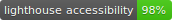
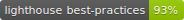
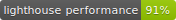

# solinfra-homepage
[](https://standardjs.com)
[](LICENSE)






Gatsby.js V2 Solinfra homepage

## Install

Install necessary dependencies via
```sh
npm install
```

*NOTE*: You may need additional packages installed for your distro to build certain binary dependencies (such as for image processing). This project has a pre-install hook for Alpine Linux currently, which may be used as a reference for other distros in the 'scripts' folder. If the hook fails, for cases where you're running as root, you may run it manually via

```sh
rm -rf node_modules/*
npm run preinstall && npm i
```

## Running

### Development

To launch a local development instance:
```sh
npm run develop
```

### Deployment

The deployment is part of a complete end-to-end CI/CD pipeline using Github actions. Push whatever latest changes ought to be live, onto the master branch. They must of course pass various checks before merging is permitted, such as linting, auditing, profiling, etc.

It's good practice to run

```sh
npm run lighthouse:badge
```

to update the badge scores appropriately for new deployments, and merge it in to master (must have chromium).


## Attributions

This site is possible thanks to the indirect help and work of the following

### Template

[@anubhavsrivastava](https://github.com/anubhavsrivastava) for the great Gatsby.js V2 starter [template](https://github.com/anubhavsrivastava/gatsby-starter-grayscale)

### Images

In order of appearance

Masthead: on [pixabay.com](https://pixabay.com/) from [@jplenio](https://www.instagram.com/jplenio/)

Dock: on [unsplash.com](https://unsplash.com/) from [@helloitsammiel](https://unsplash.com/@helloitsammiel)

Footer: on [unsplash.com](https://unsplash.com/) from [@samuelzeller](https://unsplash.com/@samuelzeller)
