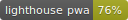
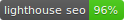

# homepage
[](LICENSE)





Gatsby.js V2 starter template based on Grayscale by startbootstrap

For an overview of the project structure please refer to the [Gatsby documentation - Building with Components](https://www.gatsbyjs.org/docs/building-with-components/).

Check online preview [here](https://anubhavsrivastava.github.io/gatsby-starter-grayscale/)

## Screenshot


## Install

Make sure that you have the Gatsby CLI program installed:

```sh
npm install --global gatsby-cli
```

And run from your CLI:

```sh
gatsby new <site-name> https://github.com/anubhavsrivastava/gatsby-starter-grayscale
```

Then you can run it by:

```sh
cd gatsby-example-site
npm install
gatsby develop
```

### Personalization

Edit `config.js` to put up your details

```javascript
module.exports = {
  siteTitle: 'Gatsby Starter grayscale', // <title>
  ...
  heading: 'Anubhav Srivastava',
  subHeading: 'Full time Web Developer. Part time Open source contributor  ',

  // social
  socialLinks: [
    {
      icon: 'fa-github',
      name: 'Github',
      url: 'https://github.com/anubhavsrivastava',
    }
    ...
  ],
};

```

### Deploying using Github page

`package.json` has a default script that uses `gh-pages` module to publish on Github pages. Simply running `npm run deploy` would publish the site on github pages.

### Contribution

Suggestions and PRs are welcome!

Please create issue or open PR request for contribution.


### License


### NOTES

needed for imagemin Mozjpeg on alpine docker, else it will just download glibc linked binary instead of compiling musl compatible version install (credits to Github user @divick):

```
apk --no-cache add shadow gcc musl-dev autoconf automake make libtool nasm tiff jpeg zlib zlib-dev file pkgconf
```

### Attributions

#### Images

Masthead: on [pixabay.com](https://pixabay.com/) from [@jplenio](https://www.instagram.com/jplenio/)
